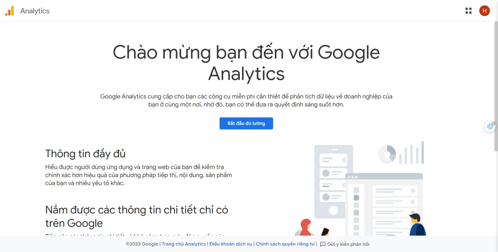
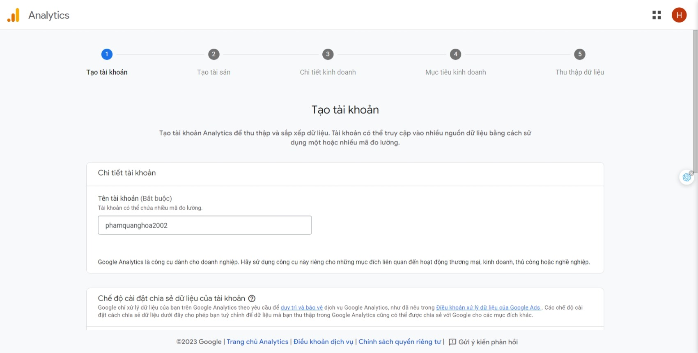
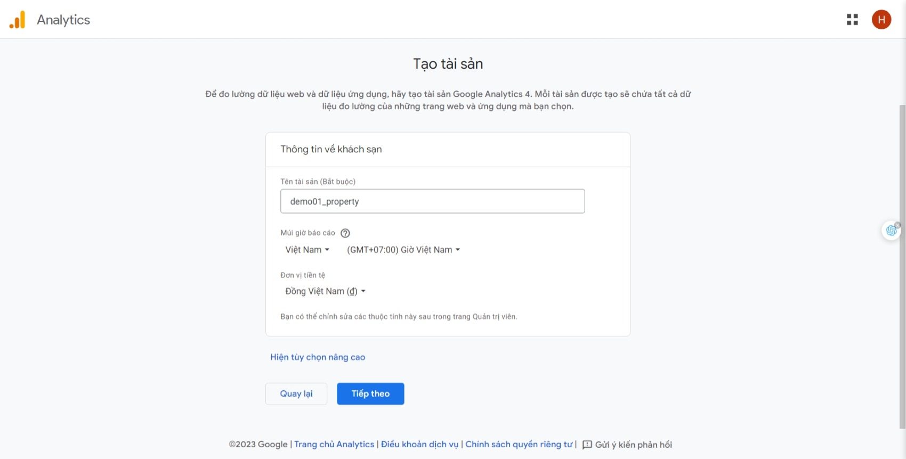

# Tìm hiểu về Google Analytics 4

## 1. Giới thiệu

Google Analytics 4 (GA4) là phiên bản mới nhất của Google Analytics. GA4 được thiết kế để cung cấp các tính năng phân tích nâng cao hơn, đồng thời cũng đơn giản hóa cách bạn thu thập dữ liệu và thiết lập các sự kiện. GA4 sẽ thay thế hoàn toàn Universal Analytics (UA) trong tương lai.

## 2. Các khái niệm cơ bản

### 2.1. Sự kiện (Event)

Sự kiện là một hành động của người dùng trên website hoặc ứng dụng của bạn. Sự kiện có thể là một hành động như xem trang, nhấp vào nút, hoặc một tương tác như tương tác với một video. Sự kiện cũng có thể là một giao dịch hoặc một chuyển đổi.

## 3. Thiết lập GA4

Có một số lựa chọn để bạn có thể thiết lập GA4:

1. Thiết lập GA4 cho hệ thống CMS (Content Management System) như Wordpress, Drupal, Joomla, ...
2. Thiết lập GA4 cho website, ứng dụng của bạn bằng cách thêm mã theo hướng dẫn của Google Analytics.

### 3.1. Thiết lập GA4 cho hệ thống CMS (Wordpress)

[Tham khảo tại đây](https://support.google.com/analytics/answer/10447272?hl=vi&ref_topic=9303319&sjid=11591491117841937287-AP#wordpress&zippy=%2Cwordpresscom)

#### 3.1.1. Tạo tài khoản GA4

Để tạo tài khoản GA4, bạn cần thực hiện các bước sau:

1. Truy cập [Google Analytics](https://analytics.google.com/) và đăng nhập tài khoản Google của bạn. Sau đó chọn nút **Bắt đầu đo lường** để bắt đầu tạo tài khoản GA4.
   
2. Điền thông tin vào mục **Tạo tài khoản** và chọn **Tiếp theo**.
   
3. Chọn **Tạo tài sản** để tạo tài sản GA4. Tài sản (property) là nơi bạn sẽ theo dõi dữ liệu của 1 website hoặc 1 ứng dụng. 1 tài khoản GA4 có thể có nhiều tài sản.
   
