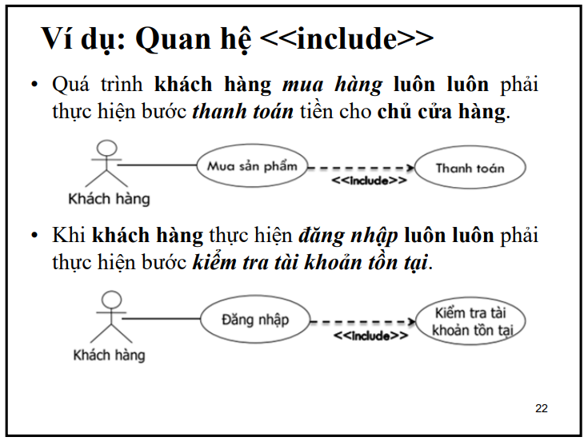
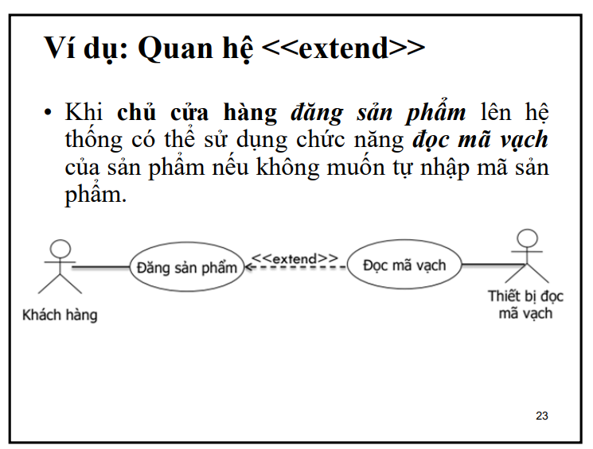

# Tìm hiểu về mô hình use case (for me)

## 1. Mô hình use case là gì?

- Mô hình use case là một mô hình phân tích, mô tả các chức năng của hệ thống mà người dùng mong muốn, mô tả các tác nhân tương tác với hệ thống và các chức năng của hệ thống đó.

## 2. Các thành phần của mô hình use case

Có 2 thành phần chính của mô hình use case:

- Use case: là một tập hợp các hành động mà hệ thống thực hiện để đạt được một kết quả mong muốn của một tác nhân.
- Actor: là một tác nhân tương tác với hệ thống để thực hiện một use case.

### 2.1 Use case

- Use case là một tập hợp các hành động mà hệ thống thực hiện để đạt được một kết quả mong muốn của một tác nhân.

- Use case là một mô tả về hành vi của hệ thống, mô tả về các chức năng của hệ thống.

- Use case là một mô tả về các chức năng của hệ thống mà người dùng mong muốn.

- 1 use case có thể có nhiều hành động, và mỗi hành động có thể có nhiều use case.

### 2.2 Actor

- Actor là một tác nhân tương tác với hệ thống để thực hiện một use case.

- Actor có thể là con người, hoặc một hệ thống khác, hay là một thiết bị khác.

## 3.Quan hệ giữa use case và actor

- Một use case có thể có nhiều actor, và một actor có thể thực hiện nhiều use case.

- Một use case có thể bao gồm một use case khác. (include)

- Một use case có thể mở rộng một use case khác. (extend)

### 3.1 Include

- Include là một quan hệ giữa các use case, trong đó một use case bao gồm một use case khác.

- Include được ký hiệu bằng mũi tên có đầu mũi tên hình tam giác, mũi tên này chỉ từ use case bao gồm đến use case được bao gồm.

- Include được sử dụng khi một use case có thể bao gồm một use case khác.

### 3.2 Extend

- Extend là một quan hệ giữa các use case, trong đó một use case mở rộng một use case khác.

- Extend được ký hiệu bằng mũi tên có đầu mũi tên hình tam giác, mũi tên này chỉ từ use case mở rộng đến use case được mở rộng.

- Extend được sử dụng khi một use case có thể mở rộng một use case khác.

Ví dụ: use case `Đăng nhập` có thể mở rộng use case `Quên mật khẩu`. Khi người dùng đăng nhập, nếu người dùng quên mật khẩu thì có thể thực hiện use case `Quên mật khẩu`.

## 4. Các bước để xây dựng mô hình use case

- Bước 1: Xác định các use case
- Bước 2: Xác định các actor
- Bước 3: Xác định các mối quan hệ giữa các use case
- Bước 4: Xác định các mối quan hệ giữa các actor
- Bước 5: Xác định các mối quan hệ giữa các use case và actor
